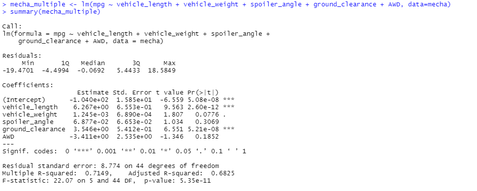
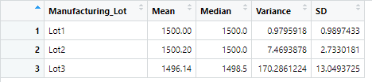

# MechaCar_Statistical_Analysis

## Linear Regression to Predict MPG
In our multiple linear regression model of the MechaCar's MPGs, we found the following:
1.  Not all variables were statistically significant in predicting MPG. Vehicle weight, spoiler angle and whether or not the car had all wheel drive were not significant predictors of the car's true MPG. Instead, the vehicle length and ground clearance were statistically significant enough to incorporate these variables as predictors for MPG. By being statistically significant, these variables provided a non-random amount of variancce to the MPG values in the dataset.

2.  Our slope in this case would be significant. In most cases, a flat slope is only used in a linear model when the there is no significant linear relationship. In this case, there are intercepts that can successfully help us predict the MechaCar's MPG's, so these would influence the model to having a non-zero slope.

3.  Since the R-Squared of this model is 0.71, the model predicts the MPG of MechaCar prototypes effectively enough. However, to add to the model's effectiveness, the lesser-significant variables (Vehicle weight, spoiler angle and AWD) can be removed to enhance the relationship.

## Summary Statistics on Suspension Coils
In our summarizations of the suspension coil data, we were told that the design specifications for the MechaCar suspension coils dictate that the variance of the suspension coils must not exceed 100 pounds per square inch. Because of this, the current manufacturing data meets this requirement in the total summary, but does not in every lot. Lot 3 is the only lot that does not meet this specification, with its variance being 170.3 PSI. Looking at the standard deviation of this data too, this lot has a significantly higher spread of PSI's. Therefore, this lot does not pass specifications, and should be examined and fixed by management. See below for details:
 
 <b>Total Summary:</b> 

 <b>Summarized by Lot:</b> 

