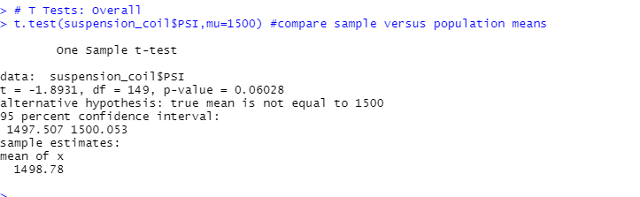
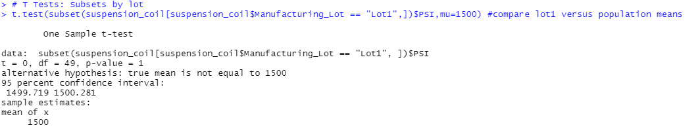
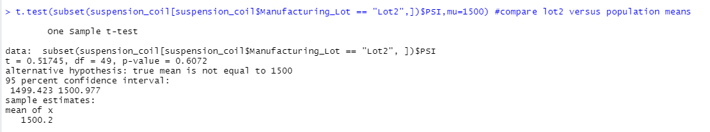
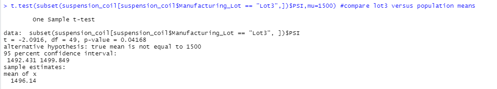

# MechaCar_Statistical_Analysis

## Overview
The purpose of this analysis is to review the production data on the MechaCar to uncover insights that may help the manufacturing team. To accomplish this, we will do the following:
- Perform multiple linear regression analysis to identify which variables in the dataset predict the mpg of MechaCar prototypes
- Collect summary statistics on the pounds per square inch (PSI) of the suspension coils from the manufacturing lots
- Run t-tests to determine if the manufacturing lots are statistically different from the mean population
- Design a statistical study to compare vehicle performance of the MechaCar vehicles against vehicles from other manufacturers. For each statistical analysis, you’ll write a summary interpretation of the findings.

### Technologies Used
- R and R Studio
  - dplyr library

## Linear Regression to Predict MPG
In our multiple linear regression model of the MechaCar's MPGs, we found the following:
1.  Not all variables were statistically significant in predicting MPG. Vehicle weight, spoiler angle and whether or not the car had all wheel drive were not significant predictors of the car's true MPG. Instead, the vehicle length and ground clearance were statistically significant enough to incorporate these variables as predictors for MPG. By being statistically significant, these variables provided a non-random amount of variancce to the MPG values in the dataset.

2.  Our slope in this case would be significant. In most cases, a flat slope is only used in a linear model when the there is no significant linear relationship. In this case, there are intercepts that can successfully help us predict the MechaCar's MPG's, so these would influence the model to having a non-zero slope.

3.  Since the R-Squared of this model is 0.71, the model predicts the MPG of MechaCar prototypes effectively enough. However, to add to the model's effectiveness, the lesser-significant variables (Vehicle weight, spoiler angle and AWD) can be removed to enhance the relationship.

## Summary Statistics on Suspension Coils
In our summarizations of the suspension coil data, we were told that the design specifications for the MechaCar suspension coils dictate that the variance of the suspension coils must not exceed 100 pounds per square inch. Because of this, the current manufacturing data meets this requirement in the total summary, but does not in every lot. Lot 3 is the only lot that does not meet this specification, with its variance being 170.3 PSI. Looking at the standard deviation of this data too, this lot has a significantly higher spread of PSI's. Therefore, this lot does not pass specifications, and should be examined and fixed by management. See below for details:
 
 <b>Total Summary:</b> 

 <b>Summarized by Lot:</b> 

## T-Tests on Suspension Coils
Based on our tests to the true population mean of 1500 PSI, the overall performance is reflective of the true mean, but lot 3 in particular does not show this relationship. 

 <b>T Test for all lots:</b> 

Assuming our significance level was the common 0.05 percent, our p-value is above our significance level. Therefore, we do not have sufficient evidence to reject the null hypothesis and can say that this mean is statistically similar to the true overall population mean of 1500. 
  
However, given that it barely passed in significance, we may want to drill down further by lot, which we do below:
  <b>T Test for lot 1:</b> 

With the same assumptions as above, our P-value for manufacturing lot 1 is well above our threshold, so the same conclusions as before apply. 
 <b>T Test for lot 2:</b> 

Similar to lot 1, lot 2 can be looked at as statistically similar to the true overall population mean of 1500.
  <b>T Test for lot 3:</b> 

The biggest anomaly in our dataset is here, in lot 3. With a p-value below our significance level, we have sufficient evidence to reject the null hypothesis and say that this subset's mean is not the statistically the same as the true population mean. With a mean of 1496.1, lot 3's statistically significant mean implies that this lot has significantly lower PSI's. 

## Study Design: MechaCar vs Competition
To better quantify how the MechaCar performs against their competition, we can test how key performance metrics stand against competition. Since miles per gallon (MPGs) are a very important factor to consider when buying a car, we will test how MechaCar's prototype cars stand out among competitors in terms of their individually tested cars. For this example, we would need to test whether or not MechaCar has a variance in MPGs that differs from the rest of their competition. The null hypothesis in this would tell us that there is no statistical significance that MechaCar has different MPGs than their competition. In the alternative hypothesis, the liklihood of a MechaCar being same in MPGs as a randomly selected sample of the competition would not be same. If there is sufficient evidence to reject the null hypothesis in this case, then this would mean that MechaCar's MPG's stand out - and either for better, or for worse. In this test design, we would test how the variance differs from the competition by using a one-way ANOVA test. This would provide us a model to determine whether or not the variability in MPG tests of MechaCars is different from the rest of the market. To gather the data required, we would need testing data from both MechaCar and all of their competition. Typically, cars are tested before going to market for MPGs, so this information may be confidential or limited in scope. However, if MechaCar can find adequate data from legitimate competitor cars, then they could gather enough data to take this to test. The cars that they sample from should have similar styles and be of the same type - for EV cars will have much different MPGs than Hummers, and so will MechaCar to these - so it'll be best to leave competition that is not directly related out. Once the data has been cleaned for comparable cars, then the data can be tested.  